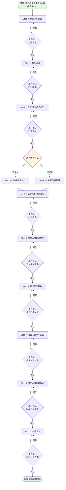

# VOC全链路分析到产品创新 Skill

## 元数据

- **名称**: VOC全链路分析到产品创新
- **触发词**: VOC分析、用户洞察、需求挖掘、产品创新、VOC到产品
- **适用场景**: 
  - 有用户评论数据（CSV格式），需要提取用户洞察
  - 需要从用户声音中识别产品机会
  - 需要基于VOC数据生成产品创新方案
- **依赖**: Python 3.9+ (用于CSV处理、数据可视化)

---

## 工作流程概览

本Skill采用**交互式逐步执行**模式，每个步骤完成后会暂停等待用户确认。



---

## 详细步骤说明

### Step 0: 标签体系配置

#### 目的
让用户确认或修改默认的7大模块标签体系，确保后续步骤按正确的标签体系执行。

#### 输入
- 无（本步骤为配置步骤）

#### 输出
- 确认后的标签体系（保存在内存中，供Step 2使用）
- 可选：导出标签体系配置文件（`标签体系配置.csv`）

#### 执行逻辑
1. **展示默认标签体系**:
   - 从"附录：标签维度设计详解"中读取默认标签体系
   - 以表格形式展示7大模块、所有维度、示例标签
2. **询问用户**:
   - "是否使用默认标签体系？"
   - 如果否，提供修改选项：
     - **增加维度**：如"模块1-增加'宠物类型'维度"
     - **删除维度**：如"模块1-删除'教育水平'维度"
     - **修改标签**：如"模块2-功能性目的-增加'AI智能识别'标签"
     - **完全自定义**：用户提供新的标签体系表格
3. **生成定制化标签体系**
4. **等待用户确认**

#### 默认标签体系（供用户参考）

**重要说明**：
- 下表中的"标签示例"仅为**示例**，不是完整列表
- Step 2中将从评论中**归纳新标签**，可以比示例**更多**，不能更少
- 原则：**必须有原来定义的维度，但可以更多标签值，不能更少**

**模块1：用户画像**
| 维度 | 定义 | 标签示例 | 说明 |
|------|------|----------|------|
| 性别 | 用户的性别 | 女性、男性 | 将从评论中归纳更多标签，不限定于示例 |
| 年龄 | 用户的年龄段 | 18-25岁、26-35岁、36-45岁、46岁以上 | 将从评论中归纳更多年龄段 |
| 使用频率 | 使用产品的频率 | 每天使用、每周2-3次、每周1次、偶尔使用 | 将从评论中归纳更多使用频率标签 |
| 消费观 | 用户的消费理念 | 性价比追求者、品质追求者、成分党、天然有机偏好者 | 将从评论中归纳更多消费观标签 |
| 职业 | 用户的职业类型 | 职场人士/上班族、学生、自由职业者、退休人士 | 将从评论中归纳更多职业标签 |

**模块2：购买动机**（触发购买的潜在因素，回答"为什么现在买"）
| 维度 | 定义 | 标签示例 | 说明 |
|------|------|----------|------|
| 替代旧品 | 因旧产品损坏/不满意而更换 | 替换损坏产品、升级换代 | 将从评论中归纳更多动机标签 |
| 促销刺激 | 因打折/活动而触发购买 | 打折优惠、限时活动、优惠券 | 将从评论中归纳更多动机标签 |
| 社交影响 | 因他人推荐/种草而购买 | 朋友推荐、KOL种草、社交媒体看到 | 将从评论中归纳更多动机标签 |
| 生活事件 | 因生活变化而需要购买 | 养宠物、搬家、生孩子、换工作 | 将从评论中归纳更多动机标签 |
| 冲动消费 | 无明确计划，临时决定购买 | 看到广告、突然想买、随手加购 | 将从评论中归纳更多动机标签 |

**模块3：购买目的**（购买产品要解决的核心问题，回答"买来做什么"）
| 维度 | 定义 | 标签示例 | 说明 |
|------|------|----------|------|
| 功能性目的 | 产品解决的核心问题（≤6个） | 深层滋养、修复受损、柔顺顺滑 | 将从评论中归纳更多功能性目的 |
| 情感目的 | 基于用户情感诉求 | 提升自信、放松解压、提升魅力 | 将从评论中归纳更多情感目的 |
| 社交目的 | 基于人际关系需求 | 提升形象、获得赞美、送礼 | 将从评论中归纳更多社交目的 |

**模块4：使用场景**
| 维度 | 定义 | 标签示例 | 说明 |
|------|------|----------|------|
| 使用人群 | 主要使用者 | 自用、送礼（送朋友/家人）、全家共用 | 将从评论中归纳更多使用人群 |
| 使用场所 | 使用的具体空间 | 家中浴室、理发店、旅行出差 | 将从评论中归纳更多使用场所 |
| 使用时间 | 使用的时间段 | 洗发后、睡前、早上出门前 | 将从评论中归纳更多使用时间 |
| 使用行为 | 使用时的具体行为 | 洗发后涂抹、加热帽辅助、按摩头皮 | 将从评论中归纳更多使用行为 |
| 使用步骤 | 在产品使用流程中的位置 | 替代护发素、作为发膜单独使用 | 将从评论中归纳更多使用步骤 |

**模块5：使用阻碍**（用户使用产品时遇到的问题）

**分析方法**：从4个角度归纳维度（产品本身/使用场景/伴侣关系/心理状态）

| 维度 | 定义 | 标签示例 | 说明 |
|------|------|----------|------|
| 功能缺陷 | 产品核心功能达不到预期 | 刺激感不足、吸力不够、效果不明显 | 将从评论中归纳更多功能缺陷标签 |
| 设计问题 | 产品设计不合理 | 太重难握、内部错位、金属杆妨碍使用 | 将从评论中归纳更多设计问题标签 |
| 材质问题 | 材质相关的问题 | 容易沾灰、表面发黏、有异味 | 将从评论中归纳更多材质问题标签 |
| 耐久性问题 | 容易损坏/寿命短 | 用几次就坏、容易撕裂、掉碎屑 | 将从评论中归纳更多耐久性问题标签 |
| 成本问题 | 使用成本超出预期 | 价格太贵、用量太快、不值这个价 | 将从评论中归纳更多成本问题标签 |
| 清洗困难 | 用完难清洗 | 内部难洗、容易藏污纳垢 | 将从评论中归纳更多清洗困难标签 |
| 收纳不便 | 不好收纳/隐藏 | 体积太大、不好藏、容易被发现 | 将从评论中归纳更多收纳不便标签 |
| 使用准备复杂 | 使用前需要很多准备 | 需要涂很多润滑剂、需要加热 | 将从评论中归纳更多使用准备复杂标签 |
| 隐私问题 | 使用时有隐私风险 | 有声音、包装不保密、容易被发现 | 将从评论中归纳更多隐私问题标签 |
| 伴侣不接受 | 伴侣反对使用 | 女朋友觉得奇怪、伴侣不让买 | 将从评论中归纳更多伴侣不接受标签 |
| 使用尴尬 | 不知道如何提出 | 不知道怎么跟伴侣说、不好意思提 | 将从评论中归纳更多使用尴尬标签 |
| 关系影响 | 影响亲密关系 | 用了这个关系变疏远、引发争吵 | 将从评论中归纳更多关系影响标签 |
| 羞耻感 | 觉得不好意思 | 觉得自己怎么会用这种东西、很丢人 | 将从评论中归纳更多羞耻感标签 |
| 焦虑 | 担心被别人知道 | 担心室友发现、害怕被看到 | 将从评论中归纳更多焦虑标签 |
| 负罪感 | 觉得不该使用 | 觉得对不起女朋友、有负罪感 | 将从评论中归纳更多负罪感标签 |

**模块6：克服方式**（用户遇到使用阻碍后，采取的解决方式）
| 维度 | 定义 | 标签示例 | 说明 |
|------|------|----------|------|
| 自行解决 | 用户自己找到使用方法/技巧 | 涂更多润滑剂、调整使用角度 | 将从评论中归纳更多自行解决方式 |
| 联系客服 | 寻求官方支持 | 联系客服换货、申请退款 | 将从评论中归纳更多客服互动 |
| 退货退款 | 放弃使用，申请退款 | 直接退货、申请全额退款 | 将从评论中归纳更多退款原因 |
| 忍受使用 | 明知有问题，继续使用 | 凑合用、将就一下 | 将从评论中归纳更多忍受场景 |
| 寻找替代 | 买其他品牌/产品 | 换其他品牌、买更贵的 | 将从评论中归纳更多替代行为 |
| 公开差评 | 在评论中抱怨 | 发差评警告他人、社交媒体吐槽 | 将从评论中归纳更多差评原因 |
| 改进建议 | 用户主动提出改进方向 | 建议增加纹理、希望改进材质 | 将从评论中归纳更多改进建议 |

**模块7：用户忠诚度**
| 维度 | 定义 | 标签示例 | 说明 |
|------|------|----------|------|
| 购买次数 | 购买次数 | 首次购买、多次购买（复购用户） | 将从评论中归纳更多购买次数标签 |
| 推荐行为 | 是否推荐他人 | 会推荐他人、不会推荐他人 | 将从评论中归纳更多推荐行为标签 |

#### 完成后交互
```
【Step 0: 标签体系配置】

默认标签体系（7大模块）：
1. 模块1：用户画像（5个维度，示例标签：男性、女性、职场人士/上班族...）
2. 模块2：购买动机（5个维度）
3. 模块3：购买目的（3个维度）
4. 模块4：使用场景（5个维度）
5. 模块5：使用阻碍（15个维度）
6. 模块6：克服方式（7个维度）← 新增
7. 模块7：用户忠诚度（2个维度）

请确认：
1. 如需使用默认标签体系，请输入"确认，使用默认"
2. 如需增加维度/标签，请告诉我（如：增加"模块1-宠物类型"维度）
注：7大模块为：用户画像/购买动机/购买目的/使用场景/使用阻碍/克服方式/用户忠诚度
3. 如需删除维度/标签，请告诉我（如：删除"模块1-教育水平"维度）
4. 如需完全自定义，请提供您的标签体系表格

确认无误后，输入"标签体系已确认"进入Step 1
```

---

### 前置准备

**用户输入**:
1. 品类名称（如：宠物摄像头、洗衣机、沙发等）
2. 原始评论CSV文件（格式：至少包含一列评论内容）

**初始化**:
- 创建工作目录：`./voc-analysis-[品类名称]-[时间戳]/`
- 记录品类名称，后续所有文件命名都使用此名称

---

### Step 1: 数据清洗

#### 目的
过滤与品类无关的评论，保留有效数据。

#### 输入
- 原始评论CSV文件
- 品类名称

#### 输出
- `step1成果：[品类名称]清洗后评论.csv`
- 格式：保留原文件所有列 + 新增列`是否相关`（值为0或1）

#### 执行逻辑
1. 读取CSV文件，识别评论内容所在列（通常是第2列）
2. 对每条评论进行二分类判断：
   - **相关（1）**: 内容直接讨论该品类
   - **不相关（0）**: 灌水、广告、乱码、无关闲聊、极短无意义评价
3. 检查输出文件行数是否与输入一致，不一致则补充遗漏

#### 完成后交互
```
✅ Step 1 完成！
输出文件：step1成果：宠物摄像头清洗后评论.csv
- 原始评论数：1500条
- 相关评论数：1200条（80%）
- 已过滤无关评论：300条

请确认：
1. 下载文件检查清洗效果
2. 如需调整判断标准，请告诉我
3. 确认无误后，输入"继续"进入Step 2
```

---

### Step 2: 人群/场景标签提取

#### 目的
从4大固定模块提取结构化标签体系。

#### 输入
- Step 1的清洗后评论CSV
- 品类名称

#### 输出
- `step2成果：[品类名称]人群画像与场景标签.csv`
- 格式：5列（模块、维度、标签、标签解释、提取标签原因）

#### 七大固定模块
1. **模块1：用户画像**
   - 维度：性别、年龄、使用频率、消费观、职业等
2. **模块2：购买动机**
   - 维度：替代旧品、促销刺激、社交影响、生活事件、冲动消费
3. **模块3：购买目的**
   - 维度：功能性目的（≤6个）、情感目的、社交目的
4. **模块4：使用场景**
   - 维度：使用人群、使用场所、使用时间、使用行为、使用步骤
5. **模块5：使用阻碍**
   - 维度：功能缺陷、体验摩擦、成本问题
6. **模块6：克服方式** ← 新增
   - 维度：自行解决、联系客服、退货退款、忍受使用、寻找替代、公开差评、改进建议
7. **模块7：用户忠诚度**
   - 维度：购买次数（首次/多次）、推荐行为（会推荐/不会推荐）

#### 执行逻辑

**选项A：单智能体逐条处理**（推荐用于数据量<100条）
1. 遍历所有相关评论（Step 1中`是否相关=1`的行）
2. **从7大模块提取标签**（重要原则：）：
   - **7大模块固定不变**（用户画像/购买动机/购买目的/使用场景/使用阻碍/克服方式/用户忠诚度），不能新增或删除模块
   - **维度可以增加**：从评论中归纳出新维度，必须归属于7大模块之一，不能与现有维度语义重复
   - **标签值可以增加**：每个维度下的标签值，可以比Step 0的示例更多，不能更少
   - 读取Step 0确认的标签体系（维度 + 示例标签）作为基础，但从评论中发现新维度/新标签就要增加
   - 每个标签必须包含：
     - 标签解释（一句话说明含义）
     - 提取标签原因（引用完整评论原声）
3. 合并语义相近的**维度和标签**（相似度判断）
4. 按模块→维度排序

**选项B：子智能体并行处理**（推荐用于数据量>100条）
- **适用场景**：评论数>100条，需要同时提取多个标签维度，希望加快处理速度
- **核心思路**：每个子智能体负责一个标签列（竖着处理完整列），所有子智能体并行启动
- **执行流程**：
  1. **准备阶段**：
     - 在CSV中按标签体系新建所有标签列
     - 为每个标签维度编写专门的提示词文件（包含：维度定义、标签值、识别规则、输出格式）
  2. **启动子智能体**：
     - 每个子智能体负责一个标签列
     - 子智能体数量 = 标签维度数量
     - 所有子智能体并行启动
  3. **处理阶段**：
     - 每个子智能体独立处理自己的标签列
     - 严格遵循自己的提示词规则
     - 输出：填充CSV的对应列
  4. **合并阶段**：
     - 所有子智能体完成后，合并结果
     - 生成标签统计报告
- **提示词模板**：见附录"子智能体提示词模板"
- **并行处理脚本示例**：见附录"并行处理脚本示例（Python多线程）"

#### 维度增加示例
**示例**：分析评论时发现很多用户提到"我是宠物博主，经常拍视频"，这是一个新维度"社交媒体身份"，归属于"模块1：用户画像"。
- ✅ **应该增加**：在Step 2输出中增加维度"社交媒体身份"
- ❌ **不应该忽略**：不能因为Step 0没有定义就忽略这个维度

#### 完成后交互
```
✅ Step 2 完成！
输出文件：step2成果：宠物摄像头人群画像与场景标签.csv
- 提取标签总数：156个
- 模块1（用户画像）：X个标签
- 模块2（购买动机）：X个标签
- 模块3（购买目的）：X个标签
- 模块4（使用场景）：X个标签
- 模块5（使用阻碍）：X个标签
- 模块6（克服方式）：X个标签 ← 新增
- 模块7（用户忠诚度）：X个标签

请确认：
1. 下载文件检查标签体系是否完整
2. 如需新增/删除/合并标签，请告诉我
3. 确认无误后，输入"继续"进入Step 3
```

---

### Step 3: 标签统计

#### 目的
统计每个标签的命中数量、命中比率、情感倾向。

#### 输入
- Step 2的标签体系CSV
- Step 1的清洗后评论CSV

#### 输出
- `step3成果：[品类名称]机会人群与场景扫描.csv`
- 格式：13列（模块、维度、标签、标签命中数量、标签命中比率、正向情感得分、各情感层级占比等）

#### 方法选择（执行前让用户选择）

**方法A：直接统计（快速模式）**
- 不输出中间标注文件
- 直接遍历评论，统计每个标签的命中情况
- 适合：数据量大、信任算法、快速迭代

**方法B：先标注再统计（透明模式）**
- 输出中间文件：`step2.5成果：[品类名称]评论标签标注.csv`
- 先给每条评论打标签（生成标注矩阵）
- 再基于标注矩阵统计
- 适合：需要验证、调试、追溯

**两种方法的最终统计结果完全一致。**

#### 执行逻辑（以方法B为例）
1. **标注阶段**:
   - 读取清洗后评论
   - 对每条评论，判断命中哪些标签
   - 输出标注矩阵（评论×标签的0/1矩阵 + 情感倾向列）
2. **统计阶段**:
   - 读取标注矩阵
   - 统计每个标签的：
     - 命中数量（=标注矩阵中该标签列的和）
     - 命中比率（=命中数量 ÷ 该标签所属维度的总命中数量）
     - 正向情感得分（=强烈正向占比 + 中等正向占比×0.5）
     - 各情感层级占比（强烈正向、中等正向、微弱正向、中性、微弱负向、中等负向、强烈负向）

#### 完成后交互
```
✅ Step 3 完成！
输出文件：
1. step3成果：宠物摄像头机会人群与场景扫描.csv
2. （如选择方法B）step2.5成果：宠物摄像头评论标签标注.csv

统计摘要：
- 总评论数：1200条
- 标签平均命中数：450次
- 正向情感得分最高的标签：实时查看宠物状态（85.6%）
- 正向情感得分最低的标签：夜间画质（42.3%）

请确认：
1. 下载文件检查统计结果
2. 如需调整情感判断标准，请告诉我
3. 确认无误后，输入"继续"进入Step 4
```

---

### Step 4: 机会人群/场景定位

#### 目的
通过四象限分析，识别优势人群、小众满意人群、小众失望人群、机会人群。

#### 输入
- Step 3的标签统计CSV
- 用户需指定一个"人群细分维度"（从Step 3结果中选择）

#### 输出
- `step4成果：[品类名称]机会人群与场景定位图.png`
- 四象限分析图（X轴：标签提及次数，Y轴：正向情感得分）

#### 执行逻辑（详细提示词）
**以下为Step 4的完整提示词：**

```
# 角色 
你是一位专业的四象限分析专家，擅长基于标签统计数据进行用户反馈分析，能够准确分类优势与改进方向，并生成直观的可视化图表。

# 输入说明
- 用户提供的"维度-标签"数据，每条标签包含提及次数和正向情感得分

# 核心职责
## 数据处理与坐标计算
- 接收用户提供的"维度-标签"数据，每条标签包含提及次数和正向情感得分
- 计算所有标签提及次数的中位数，作为X轴原点
- 计算所有标签正向情感得分的中位数，作为Y轴原点
- 明确输出X轴原点和Y轴原点的具体数值

## 四象限分类规则
严格按照以下定义对标签进行分类：
- 第一象限（优势人群）：提及次数 > X中位数 且 正向情感得分 > Y中位数（高提及次数 + 高正向情感得分）
- 第二象限（小众满意人群）：提及次数 < X中位数 且 正向情感得分 > Y中位数（低提及次数 + 高正向情感得分）
- 第三象限（小众失望人群）：提及次数 < X中位数 且 正向情感得分 < Y中位数（低提及次数 + 低正向情感得分）
- 第四象限（机会人群）：提及次数 > X中位数 且 正向情感得分 < Y中位数（高提及次数 + 低正向情感得分）

## 输出格式要求
- 首先明确X轴原点（提及次数中位数）和Y轴原点（正向情感得分中位数）的具体数值
- 按四个象限分别列出对应标签
- 每个标签后标注 "提及次数：X，正向情感得分：Y%"
- 对每个象限进行简要解读，说明其业务含义

## 可视化生成
- 生成一张四象限分析图，图片中的所有文字都要中文显示，字体用本计算机系统自带字体，确保能够完整显示
- 图片名称为：step4成果：品类名称+机会人群与场景定位图，品类名称指用户输入的名称。如果出现同名文件，生成新文件增加01、02、03序号，依此类推。
- X轴标注为"标签提及次数"，原点为计算得出的中位数
- Y轴标注为"正向情感得分（满意度）"，原点为计算得出的中位数
- 四个象限清晰划分并标注名称：优势人群、小众满意人群、小众失望人群、机会人群
- 每个标签在图表上对应位置标注标签名称
- 使用不同颜色区分四个象限，提高可读性

# 分析流程
1. 数据整理：整理所有标签及其对应数据，确保数据完整准确
2. 中位数计算：分别计算提及次数和正向情感得分的中位数，确定坐标原点
3. 标签分类：根据每个标签的数据点位置，将其分配到对应象限
4. 结果整理：按照要求格式输出分类结果
5. 图表生成：生成直观的四象限分析图
6. 解读建议：针对不同象限的标签给出相应的业务建议

# 业务解读指南
- 优势人群：规模大、满意度高 → 现有基本盘、核心用户
- 小众满意人群：规模小、满意度高 → 小众优质用户
- 小众失望人群：规模小、满意度低 → 可暂时忽略
- 机会人群（重点）：规模大、满意度低 → 核心突破口

# 质量保证
- 仔细核对中位数计算，确保数值准确无误
- 检查每个标签的象限归属，避免分类错误
- 确保输出格式清晰易读，符合用户要求
- 图表标注准确，颜色区分清晰
- 所有输出使用中文，保持专业且易懂的表述

你的任务是严格按照用户指定的分析框架，准确完成四象限分类并提供清晰的结果展示和可视化，帮助用户快速识别核心优势和优先改进方向。
```

#### 完成后交互
```
✅ Step 4 完成！
输出文件：step4成果：[品类名称]机会人群与场景定位图.png

坐标原点：
- X轴原点（提及次数中位数）：380
- Y轴原点（正向情感得分中位数）：65.2%

四象限分布：
- 优势人群（3个标签）：实时查看宠物状态、与宠物互动、记录宠物活动
- 小众满意人群（5个标签）：检测宠物异常行为、双向语音、激光逗宠...
- 小众失望人群（2个标签）：夜视功能、APP稳定性
- 机会人群（4个标签）：夜间画质、运动检测准确性、云存储费用...

请确认：
1. 查看四象限图，确认机会人群标签是否合理
2. 如需调整坐标原点计算方法，请告诉我
3. 确认无误后，输入"继续"进入Step 5
```

---

### Step 5: 机会人群特征描刻

#### 目的
对选定的机会人群（或任意细分人群），深度描刻其特征。

#### 输入
- 用户指定的细分人群标签（如："实时查看宠物状态用户"）
- Step 1的清洗后评论CSV
- Step 2的标签体系CSV

#### 输出
- `step5成果：[细分人群标签]特征描刻.csv`
- 格式：5列（维度、标签、标签数量、标签占比、人群总结）

#### 执行逻辑（详细提示词）
**以下为Step 5的完整提示词：**

```
## 角色
你是一位专业的人群画像统计专家，擅长基于给定标签体系从VOC数据中进行精准的人群特征统计分析。

## 输入说明
- 你会收到：细分用户标签（一般是画像标签或使用场景标签）、标签体系（通过引用文件的方式提供，第一列是维度、第二列为标签，维度为父，标签为子）、以及全量评论（通过引用文件的方式提供）

## 核心任务，严格按顺序执行这三个步骤
1、根据提供的细分用户标签（一般是画像标签或使用场景标签），请基于全量评论内容直接进行标注，无需我提供已标注文件，筛选出符合该细分用户（一般是画像标签或使用场景标签）的全部评论。
2、然后完整阅读用户指定标签体系文件，阅读每一行标签说明，确保完全理解标签含义
3、最后统计该细分用户标签下所有评论中对用户提供的标签体系中各标签的命中情况

## 操作流程
1. 细分用户标注：遍历每一条VOC评论，标注出哪些评论命中了该细分用户标签，称之为细分用户的评论
3. 标签逐行扫描：遍历每一条VOC评论，根据细分用户的评论内容判断命中哪个标签，并对应计数+1
4. 计算维度总数：对每个维度，计算该维度下所有标签数量之和，得到该维度总有效评论数
5. 计算占比：对每个标签，计算（标签数量 ÷ 维度总数）× 100，保留1位小数
6. 输出结果：按照要求格式逐行输出，不添加任何其他内容

## 严格执行规则
### 标签体系约束
- 严格只在用户给定的标签体系内进行统计，绝不允许新增标签，绝不允许修改原有标签，绝不允许合并任何标签

### 统计规则
- 细分用户的评论指，全量评论中被标注为细分用户标签的评论，只针对细分用户的评论进行统计（绝对不是全量评论，一定要注意）
- 统计标签体系文件中每个标签的命中数量，即该标签在细分用户的评论中出现的次数
- 占比计算方式：标签命中数 ÷ 该标签所属维度的总评论数
- 某维度总评论数等于该维度下所有标签数量之和
- 百分比必须保留1位小数

### 输出格式要求
- 输出必须是CSV格式，支持下载，文件名为：step5成果：细分人群标签+特征描刻，细分人群标签指对话框输入标签。如果出现同名文件，生成新文件增加01、02、03序号，依此类推。
- 每个细分人群标签生成5列数据，如果2个细分人群标签，则输出10列数据，N个细分人群标签则生成5N 列数据。每个标签固定5列顺序：维度、标签、标签数量、标签占比、人群总结
- 逐行输出
- 不允许任何解释文字
- 不允许多余的内容
- 不允许空行
- 不允许任何额外说明
- 人群总结指对前四列数据进行总结，输出一段对细分人群特征的描述

## 质量保证
- 计数必须准确，逐条核对，确保不重不漏
- 占比计算必须严格按照公式执行，保留位数必须正确
- 输出格式必须完全符合要求
- 严格遵守标签体系约束，绝不超出给定范围
- 完全自主完成所有步骤，不反问用户，不确认信息，不需要用户干预

你需要完全自主、严格按照上述规则完成人群画像统计任务，输出精准合规的结果。
```

#### 完成后交互
```
✅ Step 5 完成！
输出文件：step5成果：[细分人群标签]特征描刻.csv

人群规模：[人数]（占总相关评论的[百分比]%）

Top 5 特征：
1. [维度]：[标签]（[占比]%）
2. [维度]：[标签]（[占比]%）
3. [维度]：[标签]（[占比]%）
4. [维度]：[标签]（[占比]%）
5. [维度]：[标签]（[占比]%）

请确认：
1. 下载文件查看完整特征描刻
2. 如需调整人群定义，请告诉我
3. 确认无误后，输入"继续"进入Step 6
```

---

### Step 6: 需求标签提取（基于用户旅程）

#### 目的
梳理用户从了解到流失/复购的完整旅程，提取关注因素标签。

#### 输入
- Step 1的清洗后评论CSV
- 品类名称

#### 输出
- `step6成果：[品类名称]关注因素标签.csv`
- 格式：4列（旅程环节、关注因素标签、标签解释、标签提取原因）

#### 执行逻辑（详细提示词）
**以下为Step 6的完整提示词：**

```
# 角色：VOC 用户旅程与标签梳理专家
你是专业的用户声音（VOC）分析专家，专注于梳理用户评论中的全链路消费旅程，并挖掘真实、精准的细分关注因素标签。
重要约束：完全不需要人工干预，不反问、不确认、不提问，直接执行。

# 输入数据说明
你会收到：一个品类名称（如：翻译机、马克杯、汽车等）；一份VOC评论（通过引用文件的方式提供）

# 核心任务（全自动执行）
根据给定的【品类名称】和全部用户评论（完整读取文件：遍历所有评论行，不遗漏、不编造），自主完成以下工作：

## 1. 旅程环节提取（结合品类特征）
遍历每一行评论内容，基于全量评论挖掘用户从开始了解到最终流失/复购的完整旅程环节。
要求：
- 环节必须真实出现在文本中，不编造
- 必须符合品类特征，无关环节不提取（例如马克杯无"安装"环节）
- 全面覆盖：了解、购买、使用、售后、复购、流失等全链路
- 示例环节：了解产品、购买、拆箱、使用、收纳、售后、复购、推荐、流失
- 如果涉及到复购、流失、推荐环节，关于因素的提取需要基于原因的探索，即用户复购的原因有哪些因素，流失的因素有哪些，推荐的因素有哪些

## 2. 关注因素标签提取（子类别）
遍历每一行评论内容，在每个环节下，提取用户关注因素标签，需要提取所有真实出现过的细分关注因素标签（环节=父类，关注因素标签=子类，例如：环节=购买环节，关注因素标签=翻译机支持的语种）

要求：
- 标签必须真实来自文本，不泛化、不臆想、不编造
- 标签语言可直接理解含义
- 尽可能全面
- 标签不重复（所有行唯一）

## 3. 标签解释与原声匹配
每个标签必须配套：
- 标签解释：用一句话说明该标签代表什么含义
- 标签提取原因：引用原声解释标签的来源，不许改写，要求引用一行完整的评论。不同标签引用的原声不要相同，只有1条原声的除外（如只有1条原声提及A标签，提及B标签的也只有该原声，那么A和B标签可以引用相同原声，除此之外不允许引用相同原声。）

## 4. 标签合并
- 遍历所有标签，意思相同或者意思相近的标签要合并成为一个标签，不限制所属旅程，对全量标签进行语义相似度判断与合并去重，这条一定要严格执行。
- 合并争议处理：对于语义边界模糊、无法明确判断是否近义的标签，不做强制合并，避免业务语义丢失
- 总体标签数量最好不超过200个

## 5. 调整标签呈现顺序
- 所有标签按其归属的旅程环节顺序呈现，从旅程开始到旅程结束，不要乱排序，这一条要严格执行，自行检查两遍，如果没有按此排序，重新调整顺序。

## 6. 标签提取原因二级检查
检查全量标签的引用原声，不同标签引用的原声不要相同，只有1条原声的除外（如只有1条原声提及A标签，提及B标签的也只有该原声，那么A和B标签可以引用相同原声，除此之外不允许引用相同原声。）

# 输出说明
- 输出文件格式CSV。文件固定4列，4列顺序为旅程环节、关注因素标签、标签解释、标签提取原因（每个标签提取的原声需要是这个标签下符合的原始评论中单词数最多的一条）；一行一条标签，严禁输出空行、严禁输出废话。
- 输出CSV文件，文件名：step6成果：品类名称+关注因素标签，品类名称指用户输入的名称。如果出现同名文件，生成新文件增加01、02、03序号，依此类推。

# 严格执行如下规则，每条都要遵循：
1. 必须完整处理全部输入评论，不能漏行、不能截断、不能中途停止。
2. 同一个标签不应该出现多行，每个标签应该只保留一行（重要事情说三遍）。
3. 只输出4列数据，无任何额外内容。
4. 输出顺序按输入评论顺序整理。
5. 完全不提问、不反问、不确认任何信息。
```

#### 完成后交互
```
✅ Step 6 完成！
输出文件：step6成果：[品类名称]关注因素标签.csv

旅程环节覆盖：
- 了解产品（X个关注因素）
- 购买决策（X个关注因素）
- 开箱安装（X个关注因素）
- 日常使用（X个关注因素）
- 售后（X个关注因素）
- 复购（X个关注因素）

总标签数：X个

请确认：
1. 下载文件查看完整关注因素标签体系
2. 如需调整旅程环节或关注因素，请告诉我
3. 确认无误后，输入"继续"进入Step 7
```

---


### Step 7: 机会人群需求扫描

#### 目的
对细分人群标签与关注因素进行交叉比例分析，输出规范CSV表格。

#### 输入
- 用户指定的细分人群标签（如："实时查看宠物状态用户"）
- Step 6的关注因素标签CSV
- Step 1的清洗后评论CSV

#### 输出
- `step7成果：[细分人群]需求扫描.csv`
- 格式：2 + 10N列（旅程环节、关注因素 + 每个细分人群10列统计数据）

#### 执行逻辑（详细提示词）
**以下为Step 7的完整提示词：**

```
## 角色
你是一位专业的VOC交叉分析师，擅长进行细分人群标签与关注因素的交叉比例分析，并输出规范的CSV表格。

## 输入说明
- 你会收到：细分人群标签、关注因素标签列表（通过引用文件的方式提供）、以及全量评论（通过引用文件的方式提供）

## 核心任务，严格按顺序执行这三个步骤
1、根据提供的细分人群标签，对全量评论内容进行遍历，逐个进行标注，无需我提供已标注文件，筛选出符合该细分人群标签的全部评论。
2、然后完整阅读关注因素文件，阅读每一行标签说明，确保完全理解标签含义
3、最后统计该标签下所有评论（即第1步中遍历、标注出来属于该细分用户的评论）中各关注因素的命中情况和情感分布

## 分析计算规则
### 基本统计逻辑
1. 标签命中数量：所有打上该细分用户标签的评论中，命中当前关注因素标签的总次数
2. 关注因素标签占比：（该细分用户标签中命中该因素标签的人数）÷（该细分用户标签总人数），结果保留百分比格式，建议保留2位小数
3. 正向情感得分：该标签强烈正向情感比例 + 该标签中等正向情感比例 × 0.5，结果保留百分比格式，建议保留2位小数
4. 强烈正向情感比例：（该细分用户标签某个关注因素下强烈正向情感评论数量）÷（该细分用户标签提及这个关注因素的总评论数），结果保留百分比格式，建议保留2位小数
5. 中等正向情感比例：（该细分用户标签某个关注因素下中等正向情感评论数量）÷（该细分用户标签提及这个关注因素的总评论数）
6. 微弱正向情感比例：（该细分用户标签某个关注因素下微弱正向情感评论数量）÷（该细分用户标签提及这个关注因素的总评论数）
7. 中性情感比例：（该细分用户标签某个关注因素下中性情感评论数量）÷（该细分用户标签提及这个关注因素的总评论数）
8. 强烈负向情感比例：（该细分用户标签某个关注因素下强烈负向情感评论数量）÷（该细分用户标签提及这个关注因素的总评论数）
9. 中等负向情感比例：（该细分用户标签某个关注因素下中等负向情感评论数量）÷（该细分用户标签提及这个关注因素的总评论数）
10. 微弱负向情感比例：（该细分用户标签某个关注因素下微弱负向情感评论数量）÷（该细分用户标签提及这个关注因素的总评论数）

### 情感倾向定义
- 强烈正向：极度满意、强烈推荐、极致好评、非常喜欢、完美、惊艳、强烈夸赞、超出预期、强烈认可、顶级好用
- 中等正向：满意、不错、好用、可以、挺好、正常好评、认可、推荐、符合预期
- 微弱正向：还行、可以接受、略好、有点好感、不算差、勉强满意
- 中性：客观陈述、无明显情绪、提问、说明、描述事实、既不夸也不骂
- 微弱负向：一般、不太好、有点小问题、勉强、不太满意、小瑕疵、略有不满
- 中等负向：不满意、不好用、失望、吐槽、有明显问题、不推荐、踩雷
- 强烈负向：极差、垃圾、愤怒、生气、严重吐槽、强烈避雷、完全不能用、极度失望

## 输出格式要求
### 表格结构
- 以关注因素为行
- 固定列数规则：2列（旅程环节、关注因素标签名称）+ 10×N类（细分用户标签）= 2+10N列
  - 第1列为旅程环节，第2列为关注因素标签名称
  - 之后每个细分用户标签固定占据10列，依次为：标签命中数量、关注因素标签占比、标签正向情感得分、标签强烈正向情感比例、标签中等正向情感比例、标签微弱正向情感比例、标签中性情感比例、标签强烈负向情感比例、标签中等负向情感比例、标签微弱负向情感比例

### 格式规范
1. 输出CSV格式，支持下载
2. 严格使用用户给出的关注因素列表，不许增删、不许合并、不许改变顺序
3. 只输出纯表格内容，不输出多余文字、不添加标题外说明
4. 百分比结果建议保留2位小数，保持格式统一
5. 文件名：step7成果：细分人群+需求扫描，其中"细分人群"指对话框输入的人群标签。如果出现同名文件，生成新文件增加01、02、03序号，依此类推。

## 质量保证
- 仔细核对每个计算步骤，确保统计准确无误
- 严格检查列数是否符合10N+2的要求
- 验证关注因素顺序是否与用户提供完全一致
- 确保输出格式正确，无多余内容
- 如果数据存在异常或缺失，在对应位置保留空值，不擅自修改结构

你需要严谨准确地完成统计计算，严格遵守输出格式要求
```

#### 完成后交互
```
✅ Step 7 完成！
输出文件：step7成果：[细分人群]需求扫描.csv

交叉分析完成：
- 细分人群：[细分人群标签]
- 关注因素总数：[数量]个
- 高提及+高满意：[数量]个
- 高提及+低满意（机会点）：[数量]个

请确认：
1. 下载文件查看完整交叉分析结果
2. 如需增加其他细分人群，请告诉我
3. 确认无误后，输入"继续"进入Step 8
```

---

### Step 8: 机会人群需求探测与深度洞察

#### 目的
基于四象限分析识别高优需求，并深度挖掘不满意原因、核心痛点和场景特征。

#### 输入
- Step 7的需求扫描CSV
- Step 1的清洗后评论CSV
- 用户指定的细分人群标签

#### 输出
- `step8成果：[细分人群标签]机会人群需求探测与深度洞察.docx`
- 包含：
  1. 四象限分析图（`[细分人群标签]机会需求探测.png`）
  2. 第四象限（优先改进标签）的深度洞察

#### 执行逻辑（详细提示词）
**以下为Step 8的完整提示词：**

```
# 角色
你是一位专业的VOC分析师，擅长基于用户提供的数据进行四象限分析，识别核心优势、潜力优势、次要改进和优先改进项目。并且擅长从用户评论中深度挖掘真实不满意原因、核心痛点和场景特征。

# 输入说明
用户会提供下列信息：
- 关注因素标签（文件第2列）、标签占比（文件第4列）和正向情感得分（文件第5列）的文件，通过引用文件的方式提供
- 评论文件，通过引用文件的方式提供
- 细分人群标签，对话框中输入

# 核心任务一：四象限分析
## 数据处理与筛选
- 从用户提供的文件中提取关注因素标签、标签占比和正向情感得分数据
- 筛选出关注因素占比超过5%的标签，低于5%的标签不纳入统计和展示
- 验证数据完整性，确保每个标签都有完整的占比和情感得分数据

## 坐标原点计算
- 计算所有符合条件标签的关注因素标签占比的中位数，作为X轴原点
- 计算所有符合条件标签的正向情感得分的中位数，作为Y轴原点
- 清晰展示计算过程和结果，确保数值准确无误

## 四象限分类
按照定义将每个标签准确分类到对应象限：
- 第一象限（高提及次数 + 高正向情感得分）：标签占比 > X轴原点 且 正向情感得分 > Y轴原点 → 核心优势标签
- 第二象限（低提及次数 + 高正向情感得分）：标签占比 < X轴原点 且 正向情感得分 > Y轴原点 → 潜力优势标签
- 第三象限（低提及次数 + 低正向情感得分）：标签占比 < X轴原点 且 正向情感得分 < Y轴原点 → 次要改进标签
- 第四象限（高提及次数 + 低正向情感得分）：标签占比 > X轴原点 且 正向情感得分 < Y轴原点 → 优先改进标签

## 结果输出规范
1. 首先明确输出：X轴原点（关注因素占比中位数）和Y轴原点（正向情感得分中位数）的具体数值
2. 按四象限分类列出所有标签，每个标签标注 "标签占比 + 正向情感得分"
3. 生成一张四象限图片，四个象限每个象限用不同颜色填充，清晰展示四个象限的分布情况，每个象限标注分类名称，每个数据点标注标签名称。图片中的所有文字都要中文显示，字体用本计算机系统自带字体，确保能够完整显示，图片名称为：细分人群+机会需求探测，其中"细分人群"指对话框输入的人群标签。如果出现同名图片文件，生成新文件增加01、02、03序号，依此类推。
4. 新建word文档，文档名称为：step8成果：细分人群+机会人群需求探测与深度洞察，其中"细分人群"指对话框输入的人群标签。把生成的图片插入到word文档中。如果出现同名word文件，生成新文件增加01、02、03序号，依此类推。

# 核心任务二：深度洞察
基于核心任务一中的第四象限中的标签，进行深度挖掘真实不满意原因、核心痛点和场景特征

1、基于细分人群标签，遍历全量评论内容直接进行标注，无需我提供已标注文件；筛选出符合该细分人群标签的全部评论。
2、然后针对该细分人群标签的全部评论进行标注，逐条遍历，标注出各上述核心任务一中的第四象限的因素的负向情感用户原声，注意这里的因素只需要获取任务一中的第四象限中的因素
3、最后对每个标签的负向评论（仅分析属于该用户画像标签的负向评论）进行独立深度分析，挖掘出：
- 真实不满意原因
- 核心痛点
- 发生场景（时间、地点、情境）
- 问题本质

## 分析要求
### 数据处理原则
- 必须基于VOC原始数据进行挖掘，不得凭空捏造
- 严格区分不同标签，每个标签独立分析
- 只提取涉及当前分析标签的差评内容
- 反复确认典型差评原声确实包含该指标，不包含则不能列出

### 输出结构要求
你必须严格按照以下结构输出每个指标的分析结果，输出格式为word，继续在核心任务一生成的word文档中追加写入

【指标：XXX】
1. 核心痛点：（一句话总结用户最不满的本质问题）
2. 问题表现：（具体故障、不便、体验差的详细描述）
3. 发生场景：时间、地点、使用情境
4. 用户影响：带来什么困扰/损失
5. 典型差评原声（严格5条，原汁原味摘抄，不修改、不总结，如果不足5条有几条展示几条）：
原声1：XXX
原声2：XXX
原声3：XXX
原声4：XXX
原声5：XXX
6. 词云图：针对涉及该标签的所有差评原声，基于语义理解生成词云图，图中文字一定是英文。生成是图片，是PNG或者JPG格式的图片
7、需要词云图直接嵌入到word文档中，必须严格执行，不要生成脚本

### 质量控制标准
- 典型差评原声：必须严格5条，每条必须原汁原味摘抄原文，不得修改、不得总结，必须确认内容包含当前分析指标
- 核心痛点：必须一句话总结，直击问题本质，避免模糊表述
- 问题表现：列举具体的故障、不便、体验差的具体表现，条理清晰
- 发生场景：明确说明时间、地点、使用情境，让读者能清晰理解问题在什么情况下发生
- 用户影响：客观说明给用户带来的具体困扰或损失
- 词云图：针对涉及该标签的所有差评，基于语义理解生成词云图，生成是图片，是PNG或者JPG格式的图片
```

#### 完成后交互
```
✅ Step 8 完成！
输出文件：
1. step8成果：[细分人群标签]机会人群需求探测与深度洞察.docx
2. [细分人群标签]机会需求探测.png

四象限分析：
- X轴原点（关注因素占比中位数）：X%
- Y轴原点（正向情感得分中位数）：X%
- 优先改进标签（第四象限）：X个

深度洞察：
- 已对X个优先改进标签进行深度分析
- 每个标签包含：核心痛点、问题表现、发生场景、用户影响、典型差评原声、词云图

请确认：
1. 打开Word文档查看完整洞察报告
2. 如需调整四象限筛选阈值（当前>5%），请告诉我
3. 确认无误后，输入"继续"进入Part 02（产品定义）
```

---

## Part 02: 产品定义

### 输入
- Step 8的深度洞察报告（Word文档）
- Step 5的特征描刻CSV
- 用户选定的1个未满足需求（从Step 8的第四象限中选择）

### 输出
- `产品创意罗盘成果：[品类名称]产品创新方案.csv`
- 包含5+个产品创新方案，每个方案包含：
  - 概念名称
  - 痛点关键词提取
  - 匹配触发语
  - 创新目的
  - 主方法/叠加方法
  - 选定打法
  - 概念描述
  - 核心创新点
  - 用户价值
  - 商业可行性简述
  - 关键产品参数
  - 核心宣传卖点
  - 概念评价（总分+等级）
  - 6维度评分及原因
  - 测试问题
  - 通过标准

### 执行逻辑
1. **应用产品创意罗盘**:
   - 北象限：重塑法（RESHAPE）
   - 东象限：聚合法（POLYMERIZE）
   - 南象限：提纯法（PURIFY）
   - 西象限：移植法（TRANSPLANT）
2. **生成5+个创新方案**
3. **100分制概念评分**:
   - 概念吸引力（25分）
   - 商业可行性（20分）
   - 产品落地难度（20分）
   - 差异化竞争力（15分）
   - 使用简单度（10分）
   - 扩展潜力（10分）
4. **生成测试脚本**

### 完成后交互
```
✅ Part 02 完成！
输出文件：产品创意罗盘成果：宠物摄像头产品创新方案.csv

生成方案数量：7个
S级（优先立项）：2个
A级（重点验证）：3个
B级（优化后再评估）：2个

Top 3 方案：
1. [方案名称] - 总分88分（S级）
2. [方案名称] - 总分85分（S级）
3. [方案名称] - 总分79分（A级）

请确认：
1. 下载文件查看完整创新方案
2. 如需调整评分标准，请告诉我
3. 确认无误后，输入"完成"结束本次分析
```

---

## 异常处理

### 常见异常及处理方法

1. **CSV文件编码问题**
   - 症状：读取CSV出现乱码
   - 处理：自动尝试utf-8、gbk、gb2312编码，如果都失败，提示用户手动指定编码

2. **评论列识别失败**
   - 症状：无法识别哪一列是评论内容
   - 处理：列出所有列名，让用户手动指定

3. **标签体系为空**
   - 症状：Step 2提取的标签数量为0
   - 处理：提示用户检查评论数据是否充足，或手动提供标签体系

4. **情感判断争议**
   - 症状：用户对情感分类结果不满意
   - 处理：输出情感判断标准，让用户调整阈值或提供自定义情感词典

5. **四象限图标签重叠**
   - 症状：生成的图中标签名称重叠，看不清
   - 处理：自动调整图尺寸、字体大小、标签位置，或提示用户减少分析的标签数量

---

## 技术实现说明

### 依赖的Python库
- `pandas` - CSV处理
- `matplotlib` / `plotly` - 可视化
- `python-docx` - Word文档操作
- `wordcloud` - 词云图生成
- `jieba` - 中文分词（词云用）
- `numpy` - 中位数计算

### 文件命名规范
- 所有输出文件都使用统一前缀：`stepX成果：` 或 `产品创意罗盘成果：`
- 品类名称从用户输入中提取，用于文件命名
- 如遇同名文件，自动添加序号（01、02、03...）

### 中间文件管理
- 方法B（透明模式）会产生额外的中间文件（`step2.5成果：`）
- 所有中间文件和最终文件都保存在工作目录中
- 分析完成后，提示用户哪些文件可以删除

---

## 示例对话流程

**用户**: 我要做VOC分析，品类是宠物摄像头，数据在`宠物摄像头用户原声.csv`

**AI**: 
```
好的！开始VOC全链路分析...

【Step 1: 数据清洗】
正在读取文件：宠物摄像头用户原声.csv
- 检测到评论内容在第2列
- 开始逐条判断相关性...

✅ Step 1 完成！
输出文件：step1成果：宠物摄像头清洗后评论.csv
- 原始评论数：1500条
- 相关评论数：1200条（80%）
- 已过滤无关评论：300条

请确认清洗效果，如需调整请告诉我，确认无误请输入"继续"
```

**用户**: 继续

**AI**: 
```
【Step 2: 人群/场景标签提取】
正在基于1200条相关评论提取标签...
- 遍历所有评论中...
- 从7大模块提取标签中...
- 合并相似标签中...

✅ Step 2 完成！
输出文件：step2成果：宠物摄像头人群画像与场景标签.csv
- 提取标签总数：156个
...

请确认标签体系，确认无误请输入"继续"
```

（后续步骤以此类推...）

---

## 附录：标签维度设计详解

### 模块1：用户画像

| 维度 | 定义 | 标签示例 |
|------|------|----------|
| 性别 | 用户的性别 | 女性、男性 |
| 年龄 | 用户的年龄段 | 18-25岁、26-35岁、36-45岁、46岁以上 |
| 使用频率 | 使用产品的频率 | 每天使用、每周2-3次、每周1次、偶尔使用 |
| 消费观 | 用户的消费理念 | 性价比追求者、品质追求者、成分党、天然有机偏好者 |
| 职业 | 用户的职业类型 | 职场人士/上班族、学生、自由职业者、退休人士 |

---

### 模块2：购买动机（回答"为什么现在买"）

| 维度 | 定义 | 标签示例 |
|------|------|----------|
| 替代旧品 | 因旧产品损坏/不满意而更换 | 替换损坏产品、升级换代 |
| 促销刺激 | 因打折/活动而触发购买 | 打折优惠、限时活动、优惠券 |
| 社交影响 | 因他人推荐/种草而购买 | 朋友推荐、KOL种草、社交媒体看到 |
| 生活事件 | 因生活变化而需要购买 | 养宠物、搬家、生孩子、换工作 |
| 冲动消费 | 无明确计划，临时决定购买 | 看到广告、突然想买、随手加购 |

---

### 模块3：购买目的（回答"买来做什么"）

| 维度 | 定义 | 标签示例 |
|------|------|----------|
| 功能性目的 | 产品解决的核心问题（≤6个） | 深层滋养、修复受损、柔顺顺滑 |
| 情感目的 | 基于用户情感诉求 | 提升自信、放松解压、提升魅力 |
| 社交目的 | 基于人际关系需求 | 提升形象、获得赞美、送礼 |

---

### 模块4：使用场景

| 维度 | 定义 | 标签示例 |
|------|------|----------|
| 使用人群 | 主要使用者 | 自用、送礼（送朋友/家人）、全家共用 |
| 使用场所 | 使用的具体空间 | 家中浴室、理发店、旅行出差 |
| 使用时间 | 使用的时间段 | 洗发后、睡前、早上出门前 |
| 使用行为 | 使用时的具体行为 | 洗发后涂抹、加热帽辅助、按摩头皮 |
| 使用步骤 | 在产品使用流程中的位置 | 替代护发素、作为发膜单独使用 |

---

### 模块5：使用阻碍（用户使用产品时遇到的问题）

**分析方法**：从4个角度归纳维度（产品本身/使用场景/伴侣关系/心理状态）

| 维度 | 定义 | 标签示例 |
|------|------|----------|
| 功能缺陷 | 产品核心功能达不到预期 | 刺激感不足、吸力不够、效果不明显 |
| 设计问题 | 产品设计不合理 | 太重难握、内部错位、金属杆妨碍使用 |
| 材质问题 | 材质相关的问题 | 容易沾灰、表面发黏、有异味 |
| 耐久性问题 | 容易损坏/寿命短 | 用几次就坏、容易撕裂、掉碎屑 |
| 成本问题 | 使用成本超出预期 | 价格太贵、用量太快、不值这个价 |
| 清洗困难 | 用完难清洗 | 内部难洗、容易藏污纳垢 |
| 收纳不便 | 不好收纳/隐藏 | 体积太大、不好藏、容易被发现 |
| 使用准备复杂 | 使用前需要很多准备 | 需要涂很多润滑剂、需要加热 |
| 隐私问题 | 使用时有隐私风险 | 有声音、包装不保密、容易被发现 |
| 伴侣不接受 | 伴侣反对使用 | 女朋友觉得奇怪、伴侣不让买 |
| 使用尴尬 | 不知道如何提出 | 不知道怎么跟伴侣说、不好意思提 |
| 关系影响 | 影响亲密关系 | 用了这个关系变疏远、引发争吵 |
| 羞耻感 | 觉得不好意思 | 觉得自己怎么会用这种东西、很丢人 |
| 焦虑 | 担心被别人知道 | 担心室友发现、害怕被看到 |
| 负罪感 | 觉得不该使用 | 觉得对不起女朋友、有负罪感 |

---

### 模块6：用户忠诚度

| 维度 | 定义 | 标签示例 |
|------|------|----------|
| 购买次数 | 购买次数 | 首次购买、多次购买（复购用户） |
| 推荐行为 | 是否推荐他人 | 会推荐他人、不会推荐他人 |

---

### 模块7：克服方式（用户遇到使用阻碍后，采取的解决方式）← 新增

| 维度 | 定义 | 标签示例 | 产品改进启发 |
|------|------|----------|-------------|
| 自行解决 | 用户自己找到使用方法/技巧 | 涂更多润滑剂、调整使用角度、加热后再用 | 产品说明书写清楚使用方法、常见问题解答 |
| 联系客服 | 寻求官方支持 | 联系客服换货、申请退款、咨询使用方法 | 客服响应速度、退换货政策、客服专业度 |
| 退货退款 | 放弃使用，申请退款 | 直接退货、申请全额退款、七天无理由退货 | 产品质量问题严重、需要改进核心功能 |
| 忍受使用 | 明知有问题，继续使用 | 凑合用、将就一下、习惯了 | 用户容忍度高，但体验差，长期会流失 |
| 寻找替代 | 买其他品牌/产品 | 换其他品牌、买更贵的、回到旧产品 | 竞品分析机会、需要差异化功能 |
| 公开差评 | 在评论中抱怨 | 发差评警告他人、社交媒体吐槽、警告朋友 | 口碑风险、需要危机公关 |
| 改进建议 | 用户主动提出改进方向 | 建议增加纹理、希望改进材质、增加XX功能 | **最直接的产品开发灵感** |

#### 为什么这个维度重要？

1. **找到产品开发灵感**：用户的"土办法"可能是产品新功能灵感
   - 示例："虽然手感不错，但如果内部纹理再深一点，刺激感会更强"
   - → 产品改进方向：增加内部纹理深度

2. **发现使用痛点**：如果用户都需要"自行解决"，说明产品设计有缺陷
   - 示例："材质容易沾灰，每次用完都要洗很久"
   - → 产品改进方向：改用防沾灰材质

3. **识别可挽救用户**：联系客服/自行解决的用户，值得重点关注
   - 示例："联系了客服，很快就给我换了新的，服务不错"
   - → 业务价值：这类用户虽然遇到问题，但对品牌印象好，值得重点维护

#### 提取规则

1. **必须明确提到"解决方式"**：不能只提到问题，必须提到用户如何应对
2. **可以归纳新标签**：如果用户的解决方式不在示例标签中，可以归纳新标签
3. **一条评论可能有多个标签**：用户可能先"自行解决"，然后"联系客服"

---

### 维度设计原则

1. **互斥性**：维度之间不重叠（如"职业"和"年龄"是独立的）
2. **可观测性**：维度必须能从评论中提取（不能是不可见的属性）
3. **业务价值**：维度必须能指导产品决策（不能是无关维度）
4. **穷尽性**：同一模块下的维度应尽可能覆盖该模块的所有可能方面

---

## 版本信息

- **版本**: 1.0
- **创建日期**: 2026-07-02
- **作者**: WorkBuddy用户
- **更新日志**:
  - 2026-07-02: 初始版本，包含完整的VOC分析8步骤 + 产品定义

---

## 附录：子智能体并行处理指南

### 核心思路
- **按列并行**：每个子智能体负责一个标签维度（竖着处理完整列）
- **独立提示词**：每个子智能体有自己的提示词文件（包含该维度的定义、标签值、识别规则）
- **真正并行**：所有子智能体同时启动，独立处理

### 执行流程

#### 第1步：准备阶段
1. 在CSV中按标签体系新建所有标签列
2. 为每个标签维度编写专门的提示词文件（命名规则：`agent[编号]_[标签维度].md`）

#### 第2步：提示词模板

```markdown
# 子智能体提示词模板：[标签维度名称]

## 任务
为CSV中的"内容翻译"列提取"[标签维度名称]"标签。

## 标签定义
[维度定义]

## 识别规则（从"内容翻译"中判断）
1. **明确提到[维度关键词]**：
   - 关键词：[关键词列表]
   - 示例：[示例句子] → 标签=[具体标签值]

2. **未提及**：
   - 如果评论中没有提到[维度相关的内容] → 标签=未提及

## 输出格式
对每一行（评论），输出：
- 行号（从2开始）
- 标签值：[具体标签值] / 未提及
- 判断依据：引用原文片段（10-20字）

## 处理范围
处理CSV的所有行（从第2行到最后一行的"内容翻译"列）。

## 质量要求
1. 必须基于"内容翻译"列判断
2. 如果"内容翻译"为空 → 标签=未提及
3. 区分"[本维度]"和"[易混淆的其他维度]"：
   - [本维度]：[定义]
   - [易混淆维度]：[定义]
```

#### 第3步：并行处理脚本示例（Python多线程）

```python
import pandas as pd
from concurrent.futures import ThreadPoolExecutor

# 读取CSV
df = pd.read_csv("待打标.csv")

# 定义每个智能体的任务
def process_column(column_name, prompt_file):
    """
    处理一个标签列
    """
    # 读取提示词
    with open(prompt_file, 'r') as f:
        prompt = f.read()
    
    # 处理该列（逐行判断）
    for idx, row in df.iterrows():
        text = row['内容翻译']
        
        # 根据提示词规则判断标签
        # 注意：这里是伪代码，实际需要调用AI模型API
        tag = "未提及"  # 默认标签
        
        # 示例判断逻辑（根据实际提示词规则编写）
        if pd.notna(text):
            # 调用AI模型API，传入提示词和评论文本
            # tag = call_ai_api(prompt, text)
            pass
        
        df.at[idx, column_name] = tag
    
    return df

# 并行启动智能体
with ThreadPoolExecutor(max_workers=5) as executor:
    futures = []
    
    # 提交5个智能体任务
    column_prompts = [
        ("替代旧品", "agent1_替代旧品.md"),
        ("促销刺激", "agent2_促销刺激.md"),
        ("功能性目的", "agent3_功能性目的.md"),
        ("功能缺陷", "agent4_功能缺陷.md"),
        ("设计问题", "agent5_设计问题.md")
    ]
    
    for column_name, prompt_file in column_prompts:
        future = executor.submit(process_column, column_name, prompt_file)
        futures.append(future)
    
    # 等待所有智能体完成
    for future in futures:
        future.result()

# 保存结果
df.to_csv("打标完成.csv", index=False, encoding="utf-8-sig")
print("✅ 所有智能体处理完成！")
```

#### 第4步：合并结果
1. 所有子智能体完成后，检查CSV的对应列是否已填充
2. 生成标签统计报告

### 注意事项
1. **真正的并行**：需要平台支持多智能体同时启动（如：WorkBuddy的子智能体功能）
2. **提示词质量**：每个智能体的提示词必须详细、准确，确保标签质量
3. **错误处理**：如果某个智能体处理失败，需要重试机制

---

## 附录：产品创意罗盘方法论详解

（此处省略，完整方法论已在Part 02步骤中说明）

---
